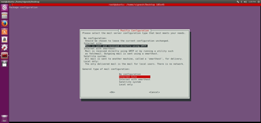
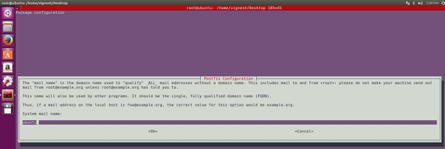

# Emailer
Send emails using `mailutils` in Ubuntu

###### Runs only on `Linux OS`

### Set up your own mailing server:
- `sudo apt-get install mailutils`

- Choose `Internet Site` in the first option.

- Enter a single `FQDN` (Fully Qualified Domain Name) in the `System mail name:` text box

###### References
- https://manpages.ubuntu.com/manpages/focal/man1/bsd-mailx.1.html
- https://mailutils.org/manual/html_section/mail.html
